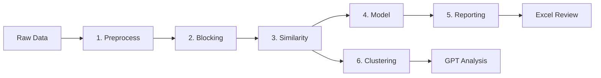

# Spreadsheet Deduplication Pipeline

A **minimal record deduplication workflow** in Python that identifies and merges duplicate entries in spreadsheet data. The pipeline cleans data, generates candidate pairs, computes similarity features, trains a model to score duplicates, and produces an easy-to-review report.

## 🚀 Quick Start

1. **Install:** `python -m pip install -r requirements.txt`
2. **Run:** `python -m src.cli.preprocess data/your_file.csv`
3. **Continue:** See [Usage Guide](docs/USAGE.md) for the complete 6-step workflow

## 📋 Minimal Data Requirements

Works with just **two columns**:
- **Record ID** (`record_id` or `sys_id`)
- **Company name** (any name/company column)

```csv
record_id,company
1,Acme Corp
2,ACME Corporation  
3,Beta LLC
```

**Optional fields for better accuracy:**
- `domain`/`website` - Domain-based matching
- `phone` - Phone number matching
- `address` - Address similarity
- `state`, `country_code` - Geographic matching

## 📚 Documentation

| Guide | Description |
|-------|-------------|
| **[Installation](docs/INSTALLATION.md)** | Setup, dependencies, virtual environments |
| **[Usage](docs/USAGE.md)** | Step-by-step commands and examples |
| **[Pipeline Steps](docs/PIPELINE_STEPS.md)** | Detailed technical documentation |
| **[GPT Integration](docs/GPT_INTEGRATION.md)** | Optional AI features and setup |
| **[AI Deduplication](docs/AI_DEDUPLICATION.md)** | 🆕 AI-powered record merging |

## 🔧 Key Features

✅ **Minimal data support** - Works with just company names and IDs  
✅ **Flexible input** - CSV, Excel files (.xlsx, .xls)  
✅ **Robust error handling** - Clear messages for missing columns  
✅ **Modular design** - Run individual steps or full pipeline  
✅ **Experiment tracking** - Comprehensive logging and statistics  
✅ **Multiple approaches** - Supervised ML + unsupervised clustering  
✅ **AI-powered deduplication** - 🆕 Intelligent record merging with OpenAI  

## ⚡ Pipeline Overview



1. **Preprocess** - Clean & normalize data
2. **Blocking** - Generate candidate pairs
3. **Similarity** - Compute feature vectors
4. **Model** - Train ML classifier
5. **Reporting** - Excel output for review
6. **Clustering** - Alternative DBSCAN approach

## 🗂️ Project Structure

```
record-deduplication/
├── 📁 data/
│   ├── your_spreadsheet.csv      # Input data
│   ├── sample_input.csv          # Sample for testing
│   └── 📁 outputs/               # All pipeline outputs
│       ├── cleaned.csv           # Preprocessed data
│       ├── features.csv          # Similarity features
│       ├── high_confidence.csv   # Likely duplicates
│       └── manual_review.xlsx    # Review spreadsheet
├── 📁 src/                       # Pipeline modules
│   ├── preprocess.py            # Data cleaning
│   ├── blocking.py              # Candidate generation
│   ├── similarity.py            # Feature computation
│   ├── model.py                 # ML training/scoring
│   ├── reporting.py             # Excel output
│   └── clustering.py            # DBSCAN clustering
├── 📁 docs/                     # Documentation
└── 📁 tests/                    # Unit tests
```

## 🚨 Troubleshooting

**Minimal dataset issues:**

| Problem | Solution |
|---------|----------|
| Missing required columns | Ensure `record_id` and `company` columns exist |
| Low accuracy | Add more fields (domain, phone, address) |
| No duplicates found | Lower confidence threshold or review manually |
| API errors (GPT) | Check `OPENAI_KEY` environment variable |

## 🧪 Testing

Run the test suite to verify installation:

```bash
python -m unittest discover
```

## 📄 License

This project is provided as-is for educational and research purposes.

---

**Need help?** Check the [detailed documentation](docs/) or run with sample data:
```bash
python -m src.cli.preprocess data/sample_input.csv --normalize --deduplicate
```