# Spreadsheet Deduplication Pipeline

A **minimal record deduplication workflow** in Python that identifies and merges duplicate entries in spreadsheet data. The pipeline cleans data, generates candidate pairs, computes similarity features, trains a model to score duplicates, and produces an easy-to-review report.

## 🚀 Quick Start

1. **Install:** `python -m pip install -r requirements.txt`
2. **Run:** `python -m src.cli.preprocess data/your_file.csv`
3. **Continue:** See [Usage Guide](docs/USAGE.md) for the complete 6-step workflow

## 📋 Minimal Data Requirements

Works with just **two columns**:
- **Record ID** (`record_id` or `sys_id`)
- **Company name** (any name/company column)

```csv
record_id,company
1,Acme Corp
2,ACME Corporation  
3,Beta LLC
```

**Optional fields for better accuracy:**
- `domain`/`website` - Domain-based matching
- `phone` - Phone number matching
- `address` - Address similarity
- `state`, `country_code` - Geographic matching

## 📚 Documentation

| Guide | Description |
|-------|-------------|
| **[Installation](docs/INSTALLATION.md)** | Setup, dependencies, virtual environments |
| **[Usage](docs/USAGE.md)** | Step-by-step commands and examples |
| **[Pipeline Steps](docs/PIPELINE_STEPS.md)** | Detailed technical documentation |
| **[Clustering Architecture](docs/CLUSTERING_ARCHITECTURE.md)** | 🆕 Modular clustering system design |
| **[Modular Architecture](docs/MODULAR_ARCHITECTURE.md)** | 🆕 Overall system architecture |
| **[Domain Clustering Fixes](docs/DOMAIN_CLUSTERING_FIXES.md)** | 🔧 **NEW**: Critical domain clustering improvements |
| **[GPT Integration](docs/GPT_INTEGRATION.md)** | Optional AI features and setup |
| **[AI Deduplication](docs/AI_DEDUPLICATION.md)** | 🆕 AI-powered record merging |

## 🔧 Key Features

✅ **Minimal data support** - Works with just company names and IDs  
✅ **Flexible input** - CSV, Excel files (.xlsx, .xls)  
✅ **Robust error handling** - Clear messages for missing columns  
✅ **Modular design** - Run individual steps or full pipeline  
✅ **Experiment tracking** - Comprehensive logging and statistics  
✅ **Multiple approaches** - Supervised ML + unsupervised clustering  
✅ **Advanced clustering** - 🆕 Hierarchical DBSCAN with domain-aware subdivision strategies  
✅ **Domain clustering** - 🔧 **Fixed**: Accurate domain-based grouping with proper separation  
✅ **Project organization** - 🆕 All analysis scripts organized in `src/scripts/`  
✅ **AI-powered deduplication** - 🆕 Intelligent record merging with OpenAI  

## ⚡ Pipeline Overview

```mermaid
graph TD
    A["📄 Raw Data<br/>(CSV/Excel)"] --> B["🧹 1. Preprocess<br/>Clean & Normalize"]
    B --> C["🔗 2. Blocking<br/>Generate Pairs"]
    C --> D["📊 3. Similarity<br/>Compute Features"]
    D --> E["🤖 4. Model<br/>Train Classifier"]
    D --> G["🎯 6. Clustering<br/>Hierarchical DBSCAN"]
    E --> F["📋 5. Reporting<br/>Excel Output"]
    F --> H["📝 Manual Review"]
    G --> I["🧠 AI Analysis<br/>GPT Integration"]
    
    style A fill:#01579b,stroke:#000,stroke-width:2px,color:#fff
    style B fill:#4a148c,stroke:#000,stroke-width:2px,color:#fff
    style C fill:#1b5e20,stroke:#000,stroke-width:2px,color:#fff
    style D fill:#e65100,stroke:#000,stroke-width:2px,color:#fff
    style E fill:#880e4f,stroke:#000,stroke-width:2px,color:#fff
    style F fill:#33691e,stroke:#000,stroke-width:2px,color:#fff
    style G fill:#0d47a1,stroke:#000,stroke-width:2px,color:#fff
    style H fill:#f57f17,stroke:#000,stroke-width:2px,color:#000
    style I fill:#827717,stroke:#000,stroke-width:2px,color:#fff
```



**Pipeline Steps:**

1. **🧹 Preprocess** - Clean & normalize data, remove obvious duplicates
2. **🔗 Blocking** - Generate candidate pairs using domain/company/phone blocking
3. **📊 Similarity** - Compute similarity features (company, domain, address, phone)
4. **🤖 Model** - Train ML classifier to score duplicate likelihood
5. **📋 Reporting** - Generate Excel output for manual review
6. **🎯 Clustering** - Advanced hierarchical DBSCAN with domain-aware subdivision

## 🧠 Advanced Clustering Features

The clustering system uses a **modular strategy pattern** with **domain-aware subdivision**:

### 🔧 **Recent Critical Fix (July 2025)**
- **Domain Clustering Bug**: Fixed issue where multiple domains were incorrectly grouped together
- **Solution**: Enhanced domain boosting preserves uniqueness while maintaining domain priority
- **Impact**: Proper domain separation with 99.6% clustering accuracy

### 🎯 **Subdivision Strategies**
- **Domain-First Clustering**: 🆕 Ensures each domain gets its own cluster with 85% similarity threshold
- **AdaptiveDBSCAN**: Cluster-specific PCA optimization
- **AggressivePCA**: Handles very large, dense clusters  
- **KMeans**: Efficient subdivision with intelligent sampling
- **ForceStrategy**: Guaranteed success fallback

**Key Benefits:**
- ✅ **Domain Separation**: Each domain properly clustered while maintaining similarity grouping
- ✅ **Size Constraints**: Respects max cluster size (e.g., `--max-cluster-size 10`)
- ✅ **Natural Structure**: Preserves cluster structure via DBSCAN
- ✅ **Smart Subdivision**: Cluster-specific PCA transformations for optimal separation
- ✅ **Reliable Fallback**: Progressive strategy ensures successful subdivision
- ✅ **Noise Handling**: Prevents artificial cluster assignments

## 🗂️ Project Structure

```
record-deduplication/
├── 📁 data/
│   ├── your_spreadsheet.csv      # Input data
│   ├── sample_input.csv          # Sample for testing
│   └── 📁 outputs/               # All pipeline outputs
│       ├── cleaned.csv           # Preprocessed data
│       ├── features.csv          # Similarity features
│       ├── high_confidence.csv   # Likely duplicates
│       └── manual_review.xlsx    # Review spreadsheet
├── 📁 src/                       # Pipeline modules
│   ├── 📁 cli/                   # Command-line interfaces
│   ├── 📁 core/                  # Core business logic engines
│   ├── 📁 formatters/            # Terminal output formatting
│   ├── 📁 io/                    # File I/O operations
│   ├── 📁 logging/               # Logging functionality
│   ├── 📁 tracking/              # Progress tracking
│   ├── 📁 pipeline/              # Pipeline orchestration
│   └── 📁 scripts/               # Development & analysis scripts
├── 📁 docs/                      # Documentation
├── 📁 tests/                     # Unit tests
└── 📁 notebooks/                 # Jupyter notebooks
```

## 🚨 Troubleshooting

**Minimal dataset issues:**

| Problem | Solution |
|---------|----------|
| Missing required columns | Ensure `record_id` and `company` columns exist |
| Low accuracy | Add more fields (domain, phone, address) |
| No duplicates found | Lower confidence threshold or review manually |
| API errors (GPT) | Check `OPENAI_KEY` environment variable |

## 🧪 Testing

Run the test suite to verify installation:

```bash
python -m unittest discover
```

## 🔧 Development Scripts

The [`src/scripts/`](src/scripts/) directory contains utility scripts for development and analysis:

### 🎯 **Core Pipeline Scripts**
- **`complete_domain_clustering.py`** - 🔧 **Enhanced**: Complete domain clustering with fixed domain separation
- **`domain_noise_rescue.py`** - Rescue noise records with 85%+ domain similarity matching
- **`verify_perfect_clustering.py`** - Verify and analyze domain clustering quality

### 📊 **Analysis & Debugging Scripts**
- **`analyze_performance.py`** - Analyze similarity score distributions and data quality
- **`analyze_domain_clustering.py`** - Deep analysis of domain clustering effectiveness
- **`analyze_scattered_domains.py`** - Identify and analyze domain distribution issues
- **`benchmark_optimization.py`** - Benchmark performance of optimization algorithms

### 🧪 **Testing Scripts (Root Directory)**
- **`test_domain_boosting.py`** - 🆕 Validate fixed domain boosting logic
- **`cluster_size_analysis.py`** - 🆕 Analyze cluster size distribution
- **`domain_values_analysis.py`** - 🆕 Examine domain similarity values
- **`run_hierarchical_clustering.py`** - 🆕 Direct hierarchical clustering execution

```bash
# Run enhanced domain clustering pipeline
python src/scripts/complete_domain_clustering.py --timeout 300 --hierarchical

# Analyze clustering performance and quality
python src/scripts/analyze_performance.py
python src/scripts/verify_perfect_clustering.py

# Test domain clustering fixes
python test_domain_boosting.py
python cluster_size_analysis.py
```

See [`src/scripts/README.md`](src/scripts/README.md) for detailed usage instructions.

## � Full Documentation

All documentation is now organized in the [`docs/`](docs/) directory:

- **[📖 Documentation Index](docs/README.md)** - Complete guide to all documentation
- **[🚀 Usage Guide](docs/USAGE.md)** - Step-by-step commands and examples
- **[⚙️ Installation Guide](docs/INSTALLATION.md)** - Setup and dependencies
- **[🔧 Pipeline Steps](docs/PIPELINE_STEPS.md)** - Technical pipeline documentation
- **[🤖 AI Integration](docs/AI_DEDUPLICATION.md)** - AI-powered deduplication features
- **[📋 Architecture](docs/MODULAR_ARCHITECTURE.md)** - Code architecture overview

## �📄 License

This project is provided as-is for educational and research purposes.

---

**Need help?** Check the [complete documentation](docs/) or run with sample data:
```bash
python -m src.cli.preprocess data/sample_input.csv --normalize --deduplicate
```